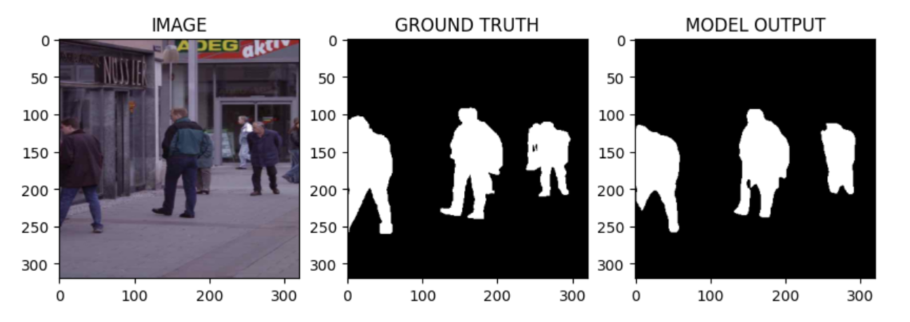

# human-segmentation-pytorch

A complete deep learning project for **human segmentation** using three state-of-the-art architectures: **UNet**, **FPN**, and **DeepLabV3+**.  
The models are trained on the **Human Segmentation Dataset** and evaluated using metrics such as **IoU**, **Dice Score**, and **training time**.


## 1. Project Overview

This project compares three architectures commonly used in semantic segmentation:  
**UNet**, **FPN**, and **DeepLabV3+**.  
The goal is to evaluate their performance on a human segmentation dataset and analyze:

- segmentation accuracy  
- generalization ability  
- visual prediction quality  


##  2. Dataset

**Dataset name:** Human Segmentation Dataset  
**Size:** 290 RGB images  
**Labels:** Binary masks (human vs background)

**Mask values:**

- `1` → human  
- `0` → background
-  
### Dataset
The Human Segmentation Dataset used in this project is originally provided by Vikram Shenoy.  
GitHub: [https://github.com/VikramShenoy97/Human-Segmentation-Dataset](https://github.com/VikramShenoy97/Human-Segmentation-Dataset)  


## 3. Installation

Install required packages:

```bash
pip install segmentation-models-pytorch
pip install git+https://github.com/albumentations-team/albumentations
pip install opencv-contrib-python

```
## 4. Models Used

- **UNet**  
  UNet is a convolutional neural network architecture designed for biomedical image segmentation.  
  It has an encoder-decoder structure with skip connections that help preserve spatial information, making it effective for segmenting small structures.

- **FPN (Feature Pyramid Network)**  
  FPN is designed to enhance feature extraction at multiple scales.  
  It builds a pyramid of features from different layers of a backbone network, allowing the model to detect objects or regions of various sizes effectively.

- **DeepLabV3+**  
  DeepLabV3+ is a state-of-the-art semantic segmentation model that uses atrous (dilated) convolutions to capture multi-scale context.  
  It also includes an encoder-decoder structure to refine segmentation boundaries and produce precise masks.

All models are implemented using `segmentation-models-pytorch`.


##  5. Training Configuration

This section summarizes the training configuration used for all models in this project. 

| Parameter      | Value               |
|----------------|-------------------|
| Epochs         | 25                 |
| Batch Size     | 16                 |
| Optimizer      | Adam               |
| Learning Rate  | 0.003              |
| Encoder        | EfficientNet-B0    |
| Image Size     | 320×320            |
| Loss Function  | Dice Loss + BCE    |

### 6. Model Performance Results

| Model         | Dice Score | IoU Score | Accuracy | Execution Time |
|---------------|------------|-----------|----------|----------------|
| **UNet**      | 0.9468     | 0.8991    | 0.9717   | 178.05 sec     |
| **FPN**       | 0.9465     | 0.8986    | 0.9712   | 142.60 sec     |
| **DeepLabV3+** | 0.3424    | 0.2068    | 0.6350   | 164.98 sec     |

> ⚠️ **Note**  
> The execution times were measured on a small dataset and a Google Colab runtime.  
> They should only be used for comparison **within this project** and do not reflect real-world performance on large-scale datasets.

### 7. Discussion of Results

The results show a clear performance gap between UNet/FPN and DeepLabV3+ for this dataset.  
UNet achieved the highest overall Dice, IoU, and accuracy, making it the most reliable model for human segmentation in this project. Its strong performance is likely due to its encoder–decoder structure, which is well-suited for small datasets and produces consistent segmentation masks.

FPN performed very similarly to UNet, with almost identical Dice and IoU scores. Its lighter architecture and pyramid feature extraction allowed it to run faster while maintaining competitive accuracy. This makes FPN a good choice when computational efficiency is important.

In contrast, DeepLabV3+ significantly underperformed on this dataset. The very low Dice and IoU scores suggest that the model did not generalize well. This may be due to:  
- the small dataset size (DeepLabV3+ typically requires large datasets),  
- higher model complexity leading to overfitting,  
- or suboptimal hyperparameters for this specific task.

  

Overall, **UNet remains the best-performing model**, closely followed by **FPN**, while **DeepLabV3+ is not suitable for small datasets in this configuration**.


